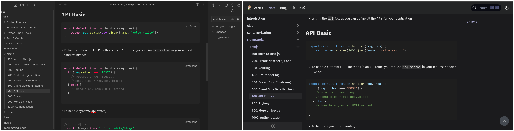

# Zekaryas's second brain

<!-- TOC -->
* [Zekaryas's second brain](#zekaryass-second-brain)
  * [How I take notes](#how-i-take-notes)
  * [Obsidian Plugins I use](#obsidian-plugins-i-use)
  * [How to setup](#how-to-setup)
  * [How to setup Docusaurus](#how-to-setup-docusaurus)
    * [Installation](#installation)
    * [Local Development](#local-development)
    * [Build](#build)
    * [Deployment](#deployment)
<!-- TOC -->

## How I take notes
- I use [Obsidian](https://obsidian.md/) a powerful and extensible knowledge base
  that works on top of your local folder of plain text files.
- I use [Obsidian git plugin](https://github.com/denolehov/obsidian-git) to back up to GitHub
- The repository uses `Docusaurus 2`, a documentation-building tool, that is useful to turn my markdown notes to beautiful sites
  - I keep my notes in the `/docs` folder of `Docusaurus`
- Algolia with `Docusaurus 2` to add instant search, which is the most useful thing

- Private notes(optional)
  - Private notes are either notes that I think aren't ready for publishing to web yet or notes that are Personal like shopping list, so they do not need to be on git or online.
  - But still if you want to store them as a backup. you can use the following simple process.
  - Use the following command to backup and restore
    - `npm run private_backup`
      - This command zips a folder called Private in docs folder and store them in `private_backup` folder
      - It also removes old backups, 30 or more days old
      - It zips folders using provided password.
      - Make sure the script is executable(`private_backup/backup_script.sh`) and `p7zip` is installed already 
    - `7z x ./private_backup/{foldername.7z} -o./private_backup`
      - This command decrypts a folder prompted the correct password.
      - You can then copy the extract folder called Private to docs dir.

## Obsidian Plugins I use
- [Obsidian git](https://github.com/denolehov/obsidian-git)
  - Simple plugin that allows you to back up your Obsidian vault to a remote Git repository (e.g. private repo on GitHub).
- [Linter](https://github.com/platers/obsidian-linter)
  - An Obsidian plugin that formats and styles your notes with a focus on configurability and extensibility.
- [Obsidian-execute-code](https://github.com/twibiral/obsidian-execute-code)
  - This plugin allows you to execute code snippets in code blocks in your notes. The plugin adds a 'run' button for code blocks in supported languages.
  - This is very useful if you have a code snippet on your note and execute it while reading.


## How to setup

- Download [Obsidian](https://obsidian.md/) and install it
- Clone this repo
  - `git clone git@github.com:zekaryas1/notes.git`
  - follow the next [Docusaurus setup](#how-to-setup-docusaurus)
- With obsidian open the `\docs` folder
- optional -> Install and configure the above [plugins](#obsidian-plugins-i-use)
- Start writing notes

## How to setup Docusaurus

This website is built using [Docusaurus 2](https://docusaurus.io/), a modern static website generator.

### Installation

```
npm install
```

### Local Development

```
$ npm run start
```

This command starts a local development server and opens up a browser window. Most changes are reflected live without having to restart the server.

### Build

```
$ npm run build
```

This command generates static content into the `build` directory and can be served using any static contents hosting service.

### Deployment

Using SSH:

```
$ USE_SSH=true npm deploy
```

Not using SSH:

```
$ GIT_USER=<Your GitHub username> npm deploy
```

If you are using GitHub pages for hosting, this command is a convenient way to build the website and push to the `gh-pages` branch.
